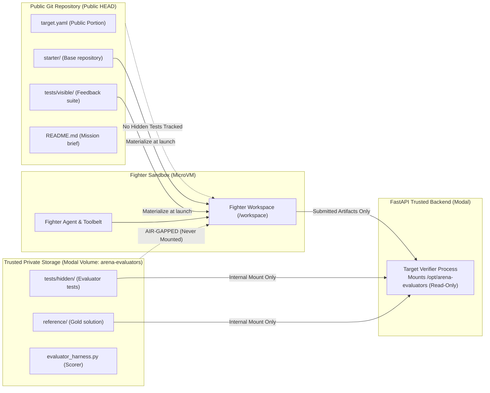
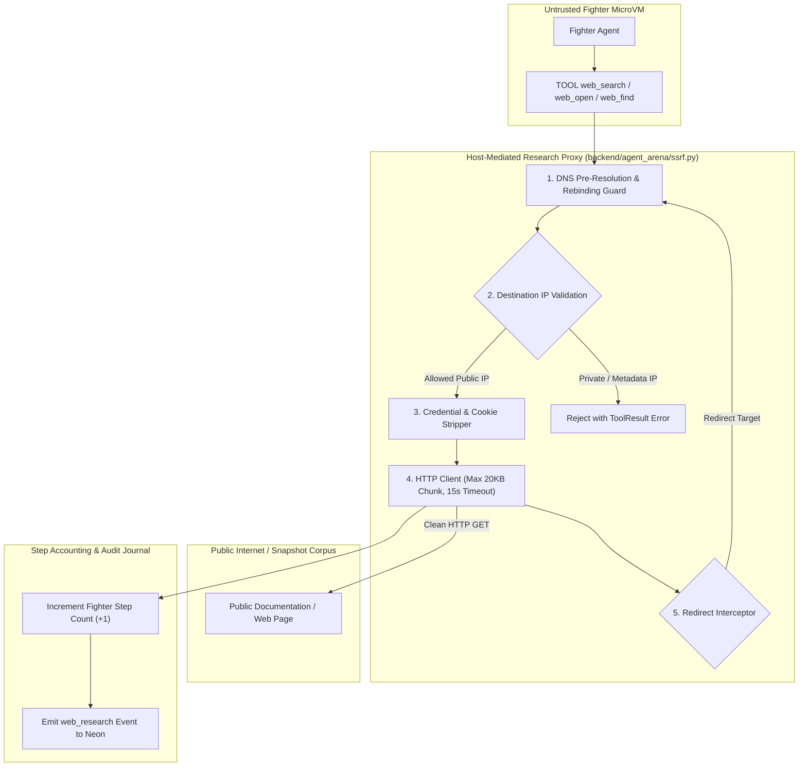

# Benchmark Secrecy, Runtime Fidelity & Controlled Web Research

> **Version**: 1.0 (Phase S, Phase R & Phase D3 Specification)  
> **Authority**: Governing contracts for private evaluator storage, target runtime materialization, and sandboxed web egress.

---

## 1. Phase S — Benchmark Secrecy & Private Evaluator Distribution

### 1.1 The Core Vulnerability
A secure Linux microVM execution jail protects the host system and prevents runtime cross-contamination. However, **runtime filesystem isolation does not solve public repository leakage**. If private evaluator tests and gold reference solutions are committed to a public git repository, web-enabled agents can simply search for the public solutions, rendering the benchmark scientifically invalid.

### 1.2 Benchmark Secrecy Architecture

### 1.3 Implementation Gates (S0–S4)

- **S0 — Package Separation**: All target packages are physically split:
  - **Public Package**: `targets/library/<target_id>/` (manifest, README, `starter/`, `tests/visible/`).
  - **Private Evaluator Package**: `targets/evaluators/<target_id>/` (mounted into `/opt/arena-evaluators/` in the trusted backend via Modal Volume `arena-evaluators`, never attached to a fighter sandbox image).
- **S1 — Public HEAD Sanitization**: Remove all `tests/hidden/**` and `reference/**` paths from public repository tracking.
- **S2 — Repository History Policy**: Past commits containing exposed evaluator tests are classified as **permanently compromised**. Official ranked benchmarks are migrated to a fresh, uncompromised private corpus; public targets remain strictly for development and local testing.
- **S3 — Benchmark Integrity Classification**: Every target declares an explicit `integrity_class`:
  - `development`: Local sandbox smoke tests and integration testing.
  - `public_demo`: Open-source benchmark targets for public demonstrations.
  - `ranked_private`: Cryptographically sealed targets used for official Elo leaderboards.
- **S4 — Live Modal Isolation Verification**: Automated deployment tests assert that the fighter microVM cannot traverse, read, or infer files within the private evaluator volume.

---

## 2. Phase R — Runtime & Target Fidelity

Fighter agents must be evaluated against genuine programming problems, not failures of container infrastructure or missing system runtimes.

### 2.1 Canonical Runtime Contract (R0 & R1)

Targets must declare an explicit `runtime` identifier in `target.yaml`. Inferred runtimes based on file extensions are strictly prohibited. The authoritative runtime registry translates IDs into deterministic Modal container images:

| Runtime ID | Base Image | Language Version | Default Tooling | Target Domain |
|---|---|---|---|---|
| `python311` | Debian Bookworm Slim | Python 3.11.8 | `pytest`, `pip`, `uv` | General Python algorithms |
| `python311-fastapi` | Debian Bookworm Slim | Python 3.11.8 | `fastapi`, `httpx`, `uvicorn`, `pydantic` | Web APIs & microservices |
| `python311-sqlite` | Debian Bookworm Slim | Python 3.11.8 | `sqlite3`, `sqlalchemy`, `alembic` | Relational database challenges |
| `node22` | Debian Bookworm Slim | Node.js 22.x LTS | `npm`, `pnpm`, `jest`, `vitest`, `tsx` | TypeScript, React & Node backends |
| `linux-gcc-make` | Debian Bookworm Slim | GNU GCC 12.2 | `gcc`, `g++`, `make`, `cmake`, `gdb` | Systems programming & C/C++ builds |

### 2.2 Dynamic Sandbox Materialization (R2 & R3)

- **Image Construction**: `sandbox_launcher.py` inspects the target's declared runtime and boots a dedicated Modal MicroVM image equipped with the corresponding toolchain.
- **Dependency Hierarchy**:
  1. *Runtime Dependencies*: Pre-baked into the base image (e.g. Node 22, Python 3.11).
  2. *Target Repository Dependencies*: Installed into the workspace during setup (e.g. `npm install` from target lockfile).
  3. *Fighter-Installed Dependencies*: Installed dynamically by the agent via `TOOL install` / `pip install`.
  4. *Forbidden Host Dependencies*: Host credentials, database drivers, or deployment tools are completely excluded from the child environment.

### 2.3 Elimination of Palindrome Fallback (R4)
Legacy versions of the harness substituted a generic string palindrome test (`DEFAULT_TEST_CODE`) when a target omitted visible test files. This silent fallback contaminated benchmark results. Under Phase R:
- Palindrome fallback code is completely removed.
- If a target omits required verification commands or test files, the target loader raises `TargetValidationError` and fails registration immediately.

---

## 3. Phase D3 / W1–W2 — Controlled Web Research Plane

Web research empowers agents to look up documentation and public knowledge, but must be strictly air-gapped from backend secrets and internal networks.

### 3.1 Web Research Architecture & Egress Gates

### 3.2 Operating Modes

| Mode | Behavior | Use Case |
|---|---|---|
| `off` (Default) | Web research tools are not materialized in the fighter environment. | Hermetic benchmark evaluation & standard battles. |
| `snapshot` | Requests are served from a deterministic, versioned web corpus. | Long-term reproducible evaluations with web assistance. |
| `live` | Outbound requests access the live public Internet through the security proxy. | Exploratory research and unconstrained toolbelt battles. |

### 3.3 Security Seatbelts & Egress Protections

1. **SSRF & Private Network Denial**:
   - Loopback addresses (`127.0.0.0/8`, `::1`) are blocked.
   - RFC 1918 subnets (`10.0.0.0/8`, `172.16.0.0/12`, `192.168.0.0/16`) are blocked.
   - Link-local and cloud metadata addresses (`169.254.169.254`, `169.254.0.0/16`) are strictly blocked.
   - Local socket schemes (`file://`, `ftp://`, `unix://`) are rejected.
2. **DNS Pre-Resolution & Rebinding Guard**: Hostnames are resolved before connection initiation. After redirects, the destination IP is re-verified to prevent DNS rebinding attacks.
3. **Complete Credential Stripping**: Outbound HTTP requests never inherit `BATTLE_TOKEN`, host API keys, cookies, or authorization headers.
4. **Step Accounting & Telemetry**: Every web call (`web_search`, `web_open`, `web_click`, `web_find`) consumes exactly one fighter step and logs query telemetry to `battle_events`.
5. **Benchmark Secrecy Gate**: Ranked evaluations with live web research are **strictly prohibited** until Phase S is completed and certified.
