# Agent Arena — Master Engineering Roadmap & Governance Specification

> **Version**: 1.1 (Canonical Program Execution Plan)  
> **Source Packages**: `rustbox/skill-graph-v0.3-final`, `rustbox/d0-implementation`, `agent-arena/`  
> **Authority**: Governing engineering blueprint for all future agent work, review gates, and evaluations.

---

## 1. Program Objective & Architecture North Star

The objective of Agent Arena is to build a trustworthy model-vs-model coding and cybersecurity benchmark where fighters:
1. Operate in genuinely isolated Linux microVM workspaces;
2. Cannot access hidden evaluators, reference solutions, or backend secrets;
3. Cannot determine or manipulate their own scores;
4. Use a canonical execution and tool protocol across any foundational LLM;
5. Autonomously discover and compose expertise through **Skill Graph v2**;
6. Can optionally research the public web through a strictly controlled research plane;
7. Learn only from legitimate, authoritative outcomes;
8. Execute targets in container environments matching each target's declared runtime;
9. Produce reproducible battle evidence; and
10. Support adaptive learning without contaminating benchmark neutrality.

### The Dependency Ordering
```text
A — Execution Kernel             COMMITTED
B — Skills / Memory Core         COMMITTED
C — Authority / Isolation        UNCOMMITTED, FINAL REVIEW
S — Benchmark Secrecy            REQUIRED BEFORE PUBLIC WEB / RANKED TRUST
R — Runtime / Target Fidelity    NEXT CORE PRODUCT SPRINT
D — Skill Graph v2               DESIGN FROZEN (v0.3), IMPLEMENTATION SEQUENCED
E — Controlled Evaluation        AFTER D
L — Adaptive Learning            AFTER STRICT EVALUATION
P — Provider Expansion           SEPARATE LOW-RISK WORKSTREAM
F — Frontend Refinement          AFTER BACKEND CONTRACTS STABILIZE
```

---

## 2. Master Engineering Governance & Phase Progression

```mermaid
flowchart TD
    subgraph Foundation["Change Sets A & B (Committed)"]
        CSA["Change Set A: Execution Kernel\n(Canonical tool protocol, process sandbox)"]
        CSB["Change Set B: Skills & Memory Core\n(Lifecycle, attribution, initial Elo)"]
    end

    subgraph GateC["Change Set C / P0 Authority & Isolation Gates"]
        Freeze["Gate C1: Code Freeze\n(No D, no providers, no frontend)"]
        Review["Gate C2: DeepSeek Adversarial Review\n(Read-only independent audit)"]
        PGTest["Gate C3: Fresh Disposable PostgreSQL Tests\n(C1-C9 concurrency & evidence races)"]
        Hermetic["Gate C4: Final Hermetic Regression\n(0 failures with external APIs blocked)"]
        CommitC["Gate C5: Clean Commit\n(feat: harden authoritative battle finalization)"]
        Freeze --> Review --> PGTest --> Hermetic --> CommitC
    end

    subgraph PreRequisites["Benchmark Pre-Requisites"]
        PhaseS["Phase S: Benchmark Secrecy\n(S0-S4: Private Evaluator distribution,\npublic HEAD cleanup, rotation policy)"]
        PhaseR["Phase R: Runtime & Target Fidelity\n(R0-R6: Runtime registry, sandbox image\nmaterialization, remove palindrome fallback)"]
    end

    subgraph SkillGraphPhase["Phase D: Skill Graph v2 Rollout"]
        D0["D0: Canonical Metadata (v2 schema)"]
        D1["D1: Hierarchical Index Graph"]
        D2["D2: Fighter Discovery API (skills())"]
        D3["D3/W1-W2: Controlled Web Research Plane"]
        D4["D4: Progressive Disclosure (L1/L2/L3)"]
        D5["D5: Public-Context Guidance"]
        D6["D6: Navigation Telemetry & Signature"]
        D7["D7: 63 Canonical Skill Bodies Authoring"]
        D8["D8: Safety & Quality Static Linting"]
        D9["D9-D11: Coverage, Fairness & Egress Tests"]
        D0 --> D1 --> D2 --> D3 --> D4 --> D5 --> D6 --> D7 --> D8 --> D9
    end

    subgraph EvaluationPhase["Scientific Evaluation & Learning"]
        Pilot["Phase D12: 18-Battle Controlled Pilot\n(6 target classes × 3 models)"]
        FullEval["Phase D13: 90-Battle Strict Evaluation\n(Strict baseline vs Skill Graph vs Web)"]
        AdaptLearning["Phase D14 / L: Adaptive Contextual Learning\n(Provenance-safe feedback & memory)"]
        Pilot --> FullEval --> AdaptLearning
    end

    CSA & CSB --> Freeze
    CommitC --> PhaseS & PhaseR
    PhaseS & PhaseR --> D0
    D9 --> Pilot
```



---

## 3. Non-Negotiable System Invariants

These invariants must survive every future change:

1. **Fighter Autonomy**: The arena supplies tools, public context, expertise, and execution resources. The arena never decides the fighter's strategy. Curation is navigation, not permission.
2. **Trusted Scoring**: The fighter must never author winners, final scores, hidden-test results, Elo updates, skill-rating updates, memory eligibility, or terminal states. Fighter output is evidence and telemetry; backend evaluation determines authoritative outcomes.
3. **Hidden Evaluator Isolation**: Fighters receive starter files, visible tests, and public READMEs. Fighters must never receive hidden tests, reference solutions, private evaluator paths, or backend secrets.
4. **Strict-Mode Fairness**: Strict evaluation is history-independent, model-independent, memory-free, and evaluator-private-data-free.
5. **Context is a Resource**: Skills, web research, tool steps, and tests consume measurable tokens, steps, and time. No arbitrary strategic caps (e.g. limiting fighters to 3 skills) are imposed.

---

## 4. Change Set C Acceptance Gates

Change Set C hardens authoritative finalization, evidence race handling, and verifier isolation.

- **Gate C1 — Freeze Change Set C**: Until independent review is complete, zero edits to Skill Graph, providers, runtime refactor, frontend, or migrations.
- **Gate C2 — DeepSeek Independent Review**: Read-only adversarial review auditing verifier authority, hidden oracle exposure, filesystem isolation, symlink attacks, evidence races, and terminal semantics.
- **Gate C3 — Fresh Disposable PostgreSQL Validation**: Execute the 9 concurrency cases (C1–C9) against a disposable local PostgreSQL container:
  - `C1`: Same battle finalized concurrently.
  - `C2`: Two battles updating the same Elo participant.
  - `C3`: Concurrent creation/update of missing leaderboard rows.
  - `C4`: Concurrent skill-rating updates.
  - `C5`: Rollback followed by retry.
  - `C6`: Finalize racing evidence persistence.
  - `C7`: Early finalize receiving incomplete evidence (remains non-terminal, succeeds when evidence arrives).
  - `C8`: Repeated finalize after completion (idempotent).
  - `C9`: Cancellation racing finalization (terminal semantics preserved).
- **Gate C4 — Final Hermetic Regression**: Default test suite passes hermetically (0 failures) with Appwrite, Neon, Modal, and external LLM APIs blocked.
- **Gate C5 — Clean Commit**: Land Change Set C in a single, reviewed commit (`feat(arena): harden authoritative battle finalization and evaluator isolation`).

---

## 5. Phase S — Benchmark Secrecy

Runtime filesystem isolation does not solve public repository leakage.

- **S0 — Private Evaluator Packaging**: Separate public target packages (`target.yaml`, `starter/`, `tests/visible/`) from private evaluator bundles (`tests/hidden/`, `reference/`, evaluator code). The backend mounts private bundles into `/opt/arena-evaluators/` via the named Modal Volume `arena-evaluators`.
- **S1 — Remove Private Evaluator Material from Public HEAD**: Stop tracking `tests/hidden/**` and `reference/**` in public git branches.
- **S2 — Benchmark History Policy**: Treat previously public hidden tests as permanently compromised; create a new private benchmark corpus for ranked evaluation while retaining public targets for development.
- **S3 — Integrity Classification**: Categorize all targets under `development`, `public_demo`, or `ranked_private`.
- **S4 — Live Modal Isolation Verification**: Run deployment verification tests proving the microVM filesystem cannot access private evaluator paths.

---

## 6. Phase R — Runtime & Target Fidelity

Fighters must be evaluated against target coding tasks, not broken container infrastructure.

- **R0 — Canonical Runtime Contract**: Targets declare explicit runtimes (e.g. `python311`, `python311-fastapi`, `node22`, `linux-gcc-make`).
- **R1 — Authoritative Runtime Registry**: Map runtime IDs to deterministic base images, package managers, and tool suites.
- **R2 — Dynamic Sandbox Materialization**: Build Modal sandboxes using the target's declared runtime rather than a single generic image.
- **R3 — Dependency Tier Separation**: Explicitly distinguish runtime-provided dependencies, target repository dependencies, and fighter-installed dependencies.
- **R4 — Palindrome Fallback Removal**: Completely eliminate `DEFAULT_TEST_CODE` palindrome fallbacks. If a target lacks visible tests, compilation fails rather than substituting an unrelated test.
- **R5 — Target Compiler Validation**: Validate manifests, runtimes, starter files, and private packages at registration time.
- **R6 — Ten-Target Runtime Matrix**: Validate all 10 canonical target categories against their native runtimes.

---

## 7. Phase D — Skill Graph v2 Implementation Plan

```text
D0 Metadata       -> Add canonical metadata types, v0.3 schema, catalog.v0.3.yaml, graph.v0.3.yaml
D1 Graph Index    -> Hierarchical 14-root index layer above catalog
D2 Discovery API  -> Implement skills(), skills(index=...), skills(search=...), skills(skill=...), use_skill(id)
D3 Web Research   -> Implement technical web research plane behind disabled feature flag
D4 Progressive    -> Three-tier disclosure: L1 Graph, L2 Card, L3 Body; deduplicate loaded bodies
D5 Public Guidance-> Rank graph entrances from public task context (no prescribed target-specific stacks)
D6 Telemetry      -> Capture navigation steps and derive deterministic strategy_signature_v1
D7 Authoring      -> Author canonical SKILL.md bodies for all 63 skills
D8 Static Lint    -> Enforce no hidden test names, no reference solutions, and valid frontmatter
D9-D11 Testing    -> Coverage tests, strict fairness invariance tests, and web egress isolation tests
D12 Pilot         -> 18-battle strict pilot (6 target classes × 3 model configurations)
D13 Evaluation    -> 90-battle controlled evaluation comparing baseline vs Skill Graph vs Web
D14 / L Adaptive  -> Adaptive contextual learning enabled only after strict-mode baseline is established
```

---

## 8. Provider (P) & Frontend (F) Workstreams

- **Workstream P (Provider Expansion)**: Land model additions in isolated commits. Filter configuration using synthetic keys, avoid real API calls in hermetic tests, and ensure frontend dynamically consumes model lists.
- **Workstream F (Frontend Refinement)**: Expose `/targets` gallery (with `TargetDetail`, category/difficulty filtering, and target battle launch), eliminate hardcoded `formats[0]?.id` assumptions, and display live execution telemetry without leaking evaluator secrets.

---

## 9. Recommended Engineering Roles

| Role | Recommended Model / Tool | Primary Focus |
|---|---|---|
| **Parent Orchestrator** | GPT-5.6 Luna / Claude Opus | Task decomposition, repository-wide reasoning, cross-subsystem coordination |
| **Lead Engineer** | Grok 4.6 High / Claude Opus | Architecture, security boundaries, concurrency, finalization, runtime design |
| **Implementation Worker** | Composer 2.5 / Fast Agent | Mechanical wiring, catalog schemas, unit tests, compatibility adapters |
| **Test Debugger** | Read-Only GPT-5.6 Luna | Failure reproduction, regression verification, independent test analysis |
| **Adversarial Reviewer** | External DeepSeek Harness | Independent external P0 audit, security challenges, race condition review |

---

## 10. The 44-Step Master Execution Checklist

```text
 1. Keep Change Set C frozen.
 2. Complete DeepSeek independent P0 review.
 3. While DeepSeek reviews, curate Skill Graph v0.3 taxonomy.
 4. Curate Runtime/Build skills.
 5. Curate Backend/API skills.
 6. Curate Data/Persistence skills.
 7. Curate Security/Adversarial skills.
 8. Curate Builder/Breaker skills.
 9. Curate Observability skills.
10. Curate Frontend/Browser skills.
11. Freeze Skill Graph Taxonomy v0.3 (Completed in rustbox).
12. Receive DeepSeek verdict on Change Set C.
13. Fix confirmed P0 blockers, if any.
14. Run fresh disposable-local-PostgreSQL concurrency/evidence suite (C1-C9).
15. Run final hermetic regression suite (0 failures).
16. Commit Change Set C cleanly.
17. Solve Phase S benchmark secrecy (evaluator separation).
18. Implement Phase R runtime materialization & eliminate palindrome fallback.
19. Install Phase D0 canonical skill metadata in backend.
20. Implement Phase D1 hierarchical graph & catalog layer.
21. Implement Phase D2 fighter discovery API.
22. Implement Phase D3 web research plane (behind disabled flag).
23. Implement Phase D4 progressive disclosure & body deduplication.
24. Implement Phase D5 public-context guidance.
25. Implement Phase D6 navigation telemetry & strategy signature.
26. Author all 63 canonical skill bodies in D7.
27. Run Phase D8 static lint & safety checks.
28. Run Phase D9-D11 coverage, fairness, and web egress tests.
29. Enable web research only after Phase S secrecy gates pass.
30. Execute Phase D12 18-battle strict pilot.
31. Analyze pilot data and correct taxonomy/runtime defects.
32. Execute Phase D13 90-battle controlled evaluation.
33. Analyze strict evaluation results.
34. Initiate Phase D14 / L adaptive contextual learning.
35. Provider expansion (P) as separate commit.
36. Frontend refinement (F) as separate commit.
37. Validate live SSE reconnect and event deduplication.
38. Validate builder-to-breaker handoff purging on live Modal.
39. Certify target verifier execution in hardened temporary environments.
40. Verify Elo calculations and leaderboard consistency in Neon.
41. Review memory provenance links (source_result_id).
42. Conduct failure taxonomy categorization on all test battles.
43. Publish updated benchmark scorecards.
44. Archive release tag and audit report.
```

---

## 11. The 15 Non-Negotiable Directives ("What NOT To Do")

1. Do NOT implement Skill Graph runtime mechanisms before Change Set C is certified and committed.
2. Do NOT enable fighter Internet access while public hidden/reference material exists in the repository.
3. Do NOT confuse runtime microVM filesystem isolation with public benchmark secrecy.
4. Do NOT mix provider catalog changes or frontend work into Change Set C.
5. Do NOT use production or shared Neon databases for concurrency race testing (use disposable local PG).
6. Do NOT allow fighter-generated telemetry or LLM prose to become authoritative scoring truth.
7. Do NOT hardcode target-to-skill answer mappings in guidance or system prompts.
8. Do NOT restrict fighters to an arbitrary maximum number of loaded skills.
9. Do NOT turn advisory prerequisites or related skills into mechanical permission gates.
10. Do NOT use historical skill Elo or user memory in strict-mode evaluations.
11. Do NOT make web research free; all web operations must consume fighter steps.
12. Do NOT allow outbound web requests to carry `BATTLE_TOKEN`, cookies, or backend credentials.
13. Do NOT treat container/infrastructure errors as model failures or losses.
14. Do NOT execute automated database migrations or schema drops without human approval.
15. Do NOT allow permissive local tooling settings to bypass project safety hooks.
