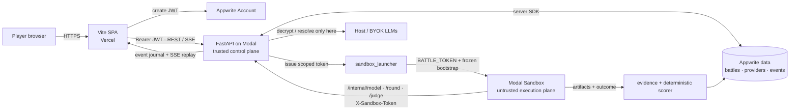
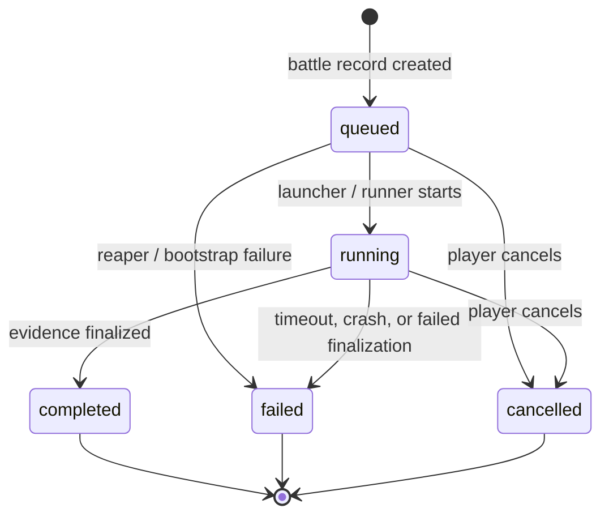
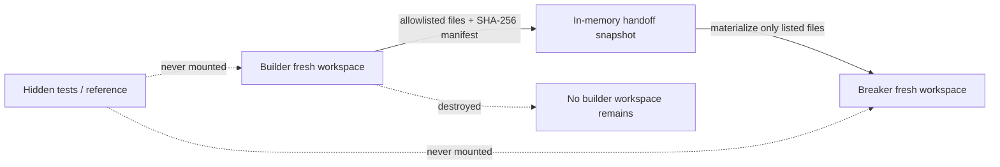
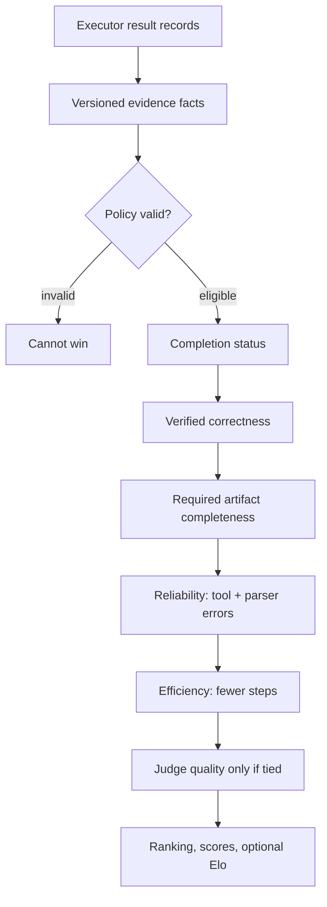
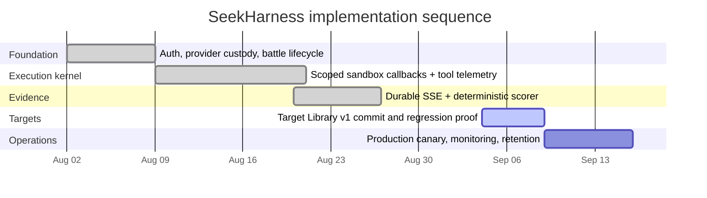

# SeekHarness Core Architecture & Implementation Plan

> **Reconstructed from the attached seekharness(6).zip source snapshot**: `seekharness/agent-arena/`.  
> This is an architecture-and-execution blueprint for the code that is present in that snapshot, including its uncommitted Target Library v1 working-tree changes. No source code was changed while preparing this document.

---

## 1. What SeekHarness actually is

SeekHarness is a live, evidence-driven arena for evaluating coding and security agents. It is not a chat application that displays two model answers. A battle is a durable, authenticated job with four distinct planes:

1. **Player plane** — a Vite + React SPA on Vercel. It lets a signed-in user choose a format, model slots, visibility, difficulty, and timeout; it then renders the live execution record.
2. **Trusted control plane** — a FastAPI application on Modal. It owns Appwrite access, provider-key encryption/decryption, battle state, final scoring, and all authority to call a provider.
3. **Untrusted execution plane** — one Modal Sandbox per real battle. It has an isolated workspace, a narrowly scoped battle token, a target bundle, and selected skill material. It never receives provider keys, database credentials, or the global internal key.
4. **Evidence plane** — durable events and rounds are transformed into versioned facts, then deterministically ranked. An LLM judge may assess quality, but it is only the last tie-breaker; it is not the authority that invents whether a test ran or passed.

### The architectural north star is simple:

> **Models may act; the sandbox may execute; the backend alone may authorize, persist, score, and expose a result.**

---

## 2. Runtime topology



### Trust boundaries

| Boundary | May contain | Must never contain |
|---|---|---|
| **Browser / SPA** | Appwrite project configuration, user JWT, public API responses | Appwrite server key, Fernet key, host/BYOK API keys, evaluator-only tests |
| **Trusted FastAPI backend** | Provider resolver, encrypted provider records, scoring and persistence | Direct model-controlled filesystem execution |
| **Modal Sandbox** | Battle-scoped token, selected skills, frozen battle bootstrap, synthetic target files | Global internal API key, provider credentials, Appwrite credentials, full target library secrets |
| **Target evaluator** | Starter overlay, submitted artifacts, visible/hidden test material | Direct access by a fighter or browser |

The source enforces the central sandbox claim in two complementary places. The launcher gives the sandbox a derived token rather than the internal signing secret, and the callback routes reject the legacy key for battle-scoped endpoints.

```python
# backend/agent_arena/sandbox_launcher.py — exact runtime pattern
sandbox_token = issue_battle_token(battle_id)
secret = modal.Secret.from_dict(
    {
        "BATTLE_TOKEN": sandbox_token,
        "BACKEND_PUBLIC_URL": _backend_public_url(),
        "BATTLE_BOOTSTRAP_JSON": json.dumps(bootstrap),
        "ARENA_SKILLS_ROOT": "/opt/arena-skills",
        "ARENA_TARGETS_DIR": "/opt/arena-targets",
    }
)
```

```python
# backend/agent_arena/internal_router.py — exact authorization rule
def _require_battle_token(
    battle_id: str,
    x_sandbox_token: str | None = Header(default=None),
    x_internal_key: str | None = Header(default=None),
) -> bool:
    # Legacy global key is deliberately ignored for battle callbacks.
    del x_internal_key
    if x_sandbox_token and verify_battle_token(x_sandbox_token, battle_id):
        return True
    raise HTTPException(status_code=401, detail="invalid or expired sandbox token")
```

---

## 3. End-to-end battle lifecycle

```mermaid
sequenceDiagram
    autonumber
    participant P as Player / SPA
    participant A as Appwrite Auth
    participant B as FastAPI backend
    participant D as Appwrite DB + event journal
    participant S as Modal Sandbox
    participant M as Provider / LLM
    participant C as Evidence scorer

    P->>A: Authenticate; create JWT
    P->>B: POST /battles (JWT, format, models, limits)
    B->>D: Validate ownership/format; persist queued battle
    B->>S: Spawn with battle-scoped token and frozen configuration
    S->>B: POST /internal/model (token, battle_id, model_id)
    B->>M: Resolve host/BYOK call spec and chat completion
    M-->>B: Model text
    B-->>S: Tool-capable agent response
    S->>B: POST /internal/round (redacted artifact/action log)
    B->>D: Persist round and durable battle event
    P->>B: GET /battles/:id/stream
    B-->>P: Replay journal, then live SSE events
    S->>B: POST /internal/finalize (structured results)
    B->>C: Build evidence; apply deterministic rules
    C->>D: Write scores, optional Elo, completion state
    B-->>P: scores + terminal done event
```

### Lifecycle states



`POST /battles` is intentionally a validation and dispatch boundary, not an execution endpoint. It checks the format, role/model cardinality, model ownership, judge ownership, target version, and the per-user active battle cap before it inserts a queued battle.

```python
# backend/agent_arena/battles.py — current pre-dispatch checks
playable = _playable_roles(cfg)
if len(body.model_ids) != len(playable):
    raise HTTPException(
        status_code=400,
        detail=f"model_ids must match non-judge roles ({len(playable)} required, got {len(body.model_ids)})",
    )
if body.arena_size != len(body.model_ids):
    raise HTTPException(status_code=400, detail="arena_size must equal len(model_ids)")
_validate_model_ids(databases, database_id, user_id, body.model_ids)
if active_battle_count(databases, database_id, user_id) >= MAX_ACTIVE_BATTLES:
    raise HTTPException(status_code=429, detail="Concurrency limit reached: 5 active battles")
```

---

## 4. Component responsibilities

| Component | Owns | Never owns |
|---|---|---|
| `frontend/src/lib/api.ts` | JWT-bearing API requests, manual SSE parser, UI data types | Credentials or scoring decisions |
| `backend/agent_arena/auth.py` | Appwrite JWT validation and centralized ownership guard | Server-key Appwrite client reuse for user JWT checks |
| `battles.py` | Battle creation, cancellation, saved artifacts, durable-first SSE | Direct model provider calls |
| `sandbox_launcher.py` | Sandbox image/bootstrap, token issuance, preview tunnel discovery | Provider keys in sandbox environment |
| `sandbox/runner.py` | Role mapping, deadline watchdog, executor selection | Datastore writes or secret resolution |
| `advanced_executor.py` | Model tool loop, workspace tools, tool telemetry, per-phase handoff | Winner selection or database authority |
| `internal_router.py` | Token-authenticated callbacks, call limits, model proxying, persistence/finalization | Browser-facing API surface |
| `target_library.py` | Target package validation, partitions, hashes, frozen config compilation | Exposing hidden/reference files to a fighter |
| `target_verifier.py` | Clean verifier workspace and visible/hidden execution | Host credential inheritance |
| `evidence.py` + `scoring.py` | Fact normalization and reproducible ranking | Filling missing data with fabricated values |
| `event_bus.py` | Local fan-out plus durable event journal | Blocking the active battle on a persistence failure |

---

## 5. Identity, providers, and key custody

The SPA authenticates directly with Appwrite. The FastAPI dependency deliberately creates a JWT-only Appwrite client rather than sharing a server-key client; that avoids confusing user identity with backend authority.

```python
# backend/agent_arena/auth.py
client = (
    Client()
    .set_endpoint(s["APPWRITE_ENDPOINT"])
    .set_project(s["APPWRITE_PROJECT_ID"])
    .set_jwt(token)
)
account = Account(client).get()
return account["$id"] if isinstance(account, dict) else account.id
```

Provider records are user-owned and encrypt the actual key before persistence. Responses return only masked_key. Host providers are synthetic, read-only records that resolve their material from server configuration only when configured. Every custom base URL is validated before it is stored, which blocks SSRF-style provider pivots.

```python
# backend/agent_arena/providers.py
base_url = validate_base_url(body.base_url)
encrypted = crypto.encrypt_key(body.api_key, _fernet_key())
payload = {
    "user_id": user_id,
    "name": body.name,
    "base_url": base_url,
    "encrypted_key": encrypted,
    "masked_key": crypto.mask_key(body.api_key),
    "auth_style": body.auth_style,
    "model_name": body.model_name,
}
```

### Minimal external contracts

| Route | Caller | Contract |
|---|---|---|
| `POST /providers` | Signed-in SPA | Store/update a user provider; encrypt key; return masked metadata |
| `POST /battles` | Signed-in SPA | Create a validated queued battle and start the runner in background |
| `GET /battles/{id}/stream` | Battle owner | Durable replay first, then live SSE; deduplicate by event id |
| `POST /battles/{id}/cancel` | Battle owner | Transition to cancelled and stop the sandbox when it has an id |
| `GET /targets`, `GET /targets/{id}` | Signed-in SPA | Public target metadata only; no hidden/reference content |
| `POST /internal/model` | Correct sandbox token | Bound/limited model proxy for a model attached to that battle |
| `POST /internal/round` | Correct sandbox token | Redact, persist, and publish an artifact/action event |
| `POST /internal/judge` | Correct sandbox token | Run configured or host judge against presented artifacts |
| `POST /internal/finalize` | Correct sandbox token | Reconstruct evidence, calculate result, write scores/Elo once |

---

## 6. Execution kernel: agent → tool → observation

The universal executor is intentionally provider-agnostic. Models that cannot issue native provider tool calls can still use the arena because the parser accepts both structured JSON tool objects and the plain `TOOL …` grammar.

```python
# backend/agent_arena/sandbox/executors/advanced_executor.py
def parse_tool_calls(text: str) -> list[dict[str, Any]]:
    json_calls = _parse_json_tools(text)
    if json_calls is not None:
        return json_calls
    calls: list[dict[str, Any]] = []
    lines = text.splitlines()
    # ... walks TOOL <name> arguments and END_TOOL bodies ...
    return calls
```

The fight loop emits a running action before it performs a process tool and overwrites the same logical tool item with `done` or `failed` afterward. That is why the browser can display a genuinely live terminal rather than a post-hoc transcript.

```python
# backend/agent_arena/sandbox/executors/advanced_executor.py
emit_action(
    model_id, tool_name_now, target=target_now, command=command_now,
    state="running", turn_id=turn + 1, tool_step=step_before + 1,
    tool_call_id=tool_call_id, exec_id=exec_id, role=role,
    workspace=work.name,
)
exec_res = sess.exec_tool(call)
emit_action(
    model_id, tool_name_now, target=target_now, command=command_now,
    state="failed" if failed else "done", duration_ms=exec_ms,
    result=sanitize_artifact(exec_res[:10000]), turn_id=turn + 1,
    tool_step=step_before + 1, tool_call_id=tool_call_id,
    exec_id=exec_id, role=role, workspace=work.name,
)
```

### Toolbelt safety policy

| Tool family | Capability | Guardrail present in the source |
|---|---|---|
| **Files** | read, write, list, grep, copy, move, remove | Path resolution stays inside the fighter workdir |
| **Process** | run, test, shell, install, background process | Child environment strips secrets; process groups are killed on timeout |
| **Network** | fetch / networked command | Format must allow network; loopback, private, link-local, metadata and redirect pivots are blocked |
| **Skills** | list / load selected SKILL.md | Progressive disclosure; only selected/mounted skills are readable |
| **Logging** | actions, artifacts, results | Output caps and artifact redaction before persistence |

```python
# backend/agent_arena/sandbox/executors/advanced_executor.py
env = _strip_secret_env(os.environ.copy())
env["ARENA_ROOT"] = str(self.root)
env["ARENA_WORKDIR"] = str(self.workdir)
proc = subprocess.Popen(
    ["bash", "-c", command], cwd=str(self.workdir),
    stdout=subprocess.PIPE, stderr=subprocess.PIPE, text=True,
    start_new_session=True, env=env,
)
```

---

## 7. Multi-phase isolation and handoffs

Builder/breaker battles are not allowed to share a disk. The executor creates a fresh work directory for each plan phase, snapshots only allowed artifacts, materializes only those bytes into the next phase, and destroys the previous work directory.



The safe handoff is encoded as real bytes, not a directory copy:

```python
# backend/agent_arena/sandbox/executors/battle_plan.py
def snapshot_handoff(work: Path, artifact_refs: list[str]) -> dict[str, Any]:
    root = work.resolve()
    files: dict[str, bytes] = {}
    manifest: list[dict[str, Any]] = []
    for ref in artifact_refs:
        rel = safe_relpath(ref)
        if rel is None or is_forbidden_handoff(rel):
            manifest.append({"path": ref, "rejected": True})
            continue
        path = (root / rel).resolve()
        path.relative_to(root)
        if not path.is_file():
            manifest.append({"path": rel, "missing": True})
            continue
        data = path.read_bytes()
        files[rel] = data
        manifest.append({"path": rel, "sha256": hashlib.sha256(data).hexdigest(), "bytes": len(data)})
    return {"files": files, "manifest": manifest}
```

**Important consequence**: a workflow format must declare its expected outputs and handoff allowlist. A generic filesystem snapshot would reintroduce test leakage, secret leakage, and accidental cross-agent coordination.

---

## 8. Target Library v1: reproducible benchmarks

The working tree adds a package-oriented target library. It replaces a loosely described task with a versioned, cryptographically identified bundle whose public, visible-test, hidden-test, and reference partitions are handled separately.

```
targets/library/<target-id>/
├── target.yaml             # canonical contract and runtime limits
├── README.md               # human-facing mission
├── starter/                # copied to agent workspace
├── tests/visible/          # copied to agent workspace for feedback
├── tests/hidden/           # evaluator-only
└── reference/              # evaluator-only gold solution
```

```yaml
# targets/library/broken-package-recovery/target.yaml — actual pattern
schema_version: 1
id: "broken-package-recovery"
format: "solo"
runtime: "node22"
workspace:
  starter_dir: "starter"
  visible_tests_dir: "tests/visible"
  hidden_tests_dir: "tests/hidden"
  reference_dir: "reference"
  protected_paths:
    - "tests/hidden/**"
network: false
verification:
  visible_command: "npm test"
  hidden_command: "pytest tests/hidden/test_integrity.py"
  ranked_requires_hidden_pass: true
limits:
  max_tool_steps: 18
  exec_timeout_seconds: 360
```

The library loader refuses absolute paths, `..` traversal, invalid characters, and symlink escapes. It independently hashes the manifest, starter tree, and hidden-test tree. The battle record receives the frozen `target_id`, target version, manifest hash, and compiled battle configuration at creation time, so later catalog changes cannot silently change a running or saved match.

```python
# backend/agent_arena/target_library.py
def _validate_safe_relative_path(rel_path: str, context: str = "") -> str:
    clean = str(rel_path or "").replace("\\", "/").strip()
    while clean.startswith("./"):
        clean = clean[2:]
    if not clean or clean.startswith("/"):
        raise TargetSecurityError(f"Invalid path '{rel_path}' in {context}: must be relative")
    parts = clean.split("/")
    if ".." in parts or "." in parts:
        raise TargetSecurityError(f"Path traversal detected in '{rel_path}' ({context})")
    if not _SAFE_PATH_REGEX.match(clean):
        raise TargetSecurityError(f"Invalid characters in path '{rel_path}' ({context})")
    return clean
```

### Target verifier boundary

The verifier reconstructs a clean temporary workspace. It overlays submitted artifacts only after rejecting escape and evaluator paths, mounts hidden tests only in that verifier workspace, and builds a narrow environment. This makes hidden-test passage meaningful rather than something a fighter can fake with a `TEST_PASS` string.

```python
# backend/agent_arena/target_verifier.py
_ALLOWED_ENV_VARS = {"PATH", "HOME", "TMPDIR", "LANG", "LC_ALL", "TERM", "USER", "LOGNAME", "SHELL", "TZ"}
_STRIP_KEY_PATTERNS = re.compile(
    r"(KEY|SECRET|TOKEN|PASSWORD|PASSWD|AUTH|APPWRITE|MODAL|INTERNAL|BEARER|CREDENTIAL|PRIVATE|DATABASE|URL)",
    re.IGNORECASE,
)

def _build_hardened_env(work: pathlib.Path, extra_env: dict[str, str] | None = None) -> dict[str, str]:
    clean_env = {
        k: v for k, v in os.environ.items()
        if k in _ALLOWED_ENV_VARS and not _STRIP_KEY_PATTERNS.search(k)
    }
    clean_env["PYTHONPATH"] = str(work)
    clean_env["ARENA_ROOT"] = str(work)
    clean_env["ARENA_WORKDIR"] = str(work)
    return clean_env
```

---

## 9. Evidence and deterministic scoring

The scoring system has an intentional anti-hallucination property: when a result does not show that a test ran, it records `None`, not a made-up zero or pass. Evidence is versioned (`schema_version` and `scoring_version`) so historical battles can be re-scored without re-running agents.



The ordering is lexicographic; it is not a weighted prose impression. The implementation makes an invalid policy record ineligible before it considers correctness, and it only uses the judge when all earlier objective tiers tie.

```python
# backend/agent_arena/scoring.py
def compare_phase_result(a: dict, b: dict) -> int:
    a_in, b_in = _is_ineligible(a), _is_ineligible(b)
    if a_in or b_in:
        if a_in != b_in:
            return 1 if a_in else -1
    if _policy_rank(a) != _policy_rank(b):
        return -1 if _policy_rank(a) < _policy_rank(b) else 1
    if _STATUS_RANK.get(a.get("status"), 4) != _STATUS_RANK.get(b.get("status"), 4):
        return -1 if _STATUS_RANK.get(a.get("status"), 4) < _STATUS_RANK.get(b.get("status"), 4) else 1
    correctness = _ratio_cmp(a.get("correctness") or {}, b.get("correctness") or {})
    if correctness:
        return correctness
    # Then: required artifacts, tool/parse errors, step count, judge quality.
```

### Durable live console

`event_bus.publish()` enriches every event with a UUID and timestamp, fans it out in process, and asynchronously writes a trimmed durable version to `battle_events`. `GET /stream` replays durable events first, then merges live events ordered by `(created_at, event_id)`. The React client merges the running/done versions of a tool action by `tool_call_id` so a row updates in place.

```typescript
// frontend/src/lib/api.ts
export async function streamBattle(
  battleId: string, token: string, onEvent: (ev: StreamEvent) => void,
  signal?: AbortSignal,
): Promise<void> {
  const res = await fetch(`${BASE}/battles/${battleId}/stream`, {
    headers: { Authorization: `Bearer ${token}`, Accept: "text/event-stream" },
    signal,
  });
  // Reads event:/data: frames and calls onEvent with parsed JSON.
}
```

This is the correct UI architecture for a live battle: terminal panes are a projection of signed-in, replayable runtime events rather than demo data or local faux execution.

---

## 10. Persistent data model

| Collection | Purpose | Critical fields |
|---|---|---|
| **providers** | User-owned encrypted provider configuration | user_id, encrypted_key, masked_key, base_url, model_name |
| **formats** | Server-defined format behavior | engine, JSON config |
| **battles** | Durable job and frozen configuration | user, models, status, timeout, battle_config, target/spec hashes |
| **battle_events** | Replayable runtime journal | battle_id, event_id, JSON payload, timestamp |
| **rounds** | Saved redacted artifacts | battle, phase, model, artifact |
| **scores** | Final model scores | battle, model, score, judge metadata |
| **leaderboard** | Per-format and overall Elo | model, format, rating, games |
| **skills / memories** | Post-battle learning signals | skill Elo/use rates and scoped battle insight |
| **targets** | Reserved target metadata persistence | target id and serialized configuration |

The battle row is the authoritative lifecycle record. Events are append-like journal material; they should not be used as an alternate mutable state machine. Scores are created idempotently at finalization and only ranked battles should update Elo.

---

## 11. Implementation plan — sequence and acceptance gates

The attached tree already implements much of Phases 0–4. The plan below names the work in dependency order, separates implementation from deployment proof, and avoids a broad rewrite.



### Phase 0 — lock the contract (implemented; preserve)
- Keep Vercel static-only. The browser may hold a user JWT but never an LLM or Appwrite server secret.
- Keep Appwrite as authentication and durable document store. Use the backend’s server SDK only behind FastAPI routes.
- Keep an explicit battle state machine and user ownership checks on every resource route.
- Keep `ARENA_USE_MOCK=1` as a controlled local/test fallback only; a production verification battle must use the sandbox path.
- **Acceptance gate**: an unauthenticated request is rejected; one user cannot read, save, cancel, or use another user’s providers/battles; a battle cannot begin with a role/model mismatch.

### Phase 1 — secure battle dispatch (implemented; verify on each release)
- Freeze the selected format configuration at launch, particularly for custom and target-backed battles.
- Enforce `MAX_ACTIVE_BATTLES = 5` per user, request-level timeouts, and no more than six model slots.
- Issue a signed `battle_id|expiry` token. The backend verifies signature, battle scope, and expiry on every sandbox callback.
- Keep `/internal/*` out of the public OpenAPI surface; use battle token auth for model, round, judge, status, and finalize operations.
- **Acceptance gate**: a token for Battle A fails for Battle B; expired token fails; a sandbox cannot request a model not attached to its battle; request/message/token budgets are enforced.

### Phase 2 — execution kernel and least-privilege workspaces (implemented; regression-test)
- Run the universal executor only under `ARENA_IN_SANDBOX=1` for real battles.
- Apply the watchdog deadline above individual tool command timeouts; a timed-out battle becomes terminal rather than continuing in background.
- Maintain path jail, symlink/path escape checks, secret-stripped child environments, output caps, background process cleanup, SSRF/egress filtering, and per-format network policy.
- Mount the minimum selected skill set. Loading a skill exposes only its `SKILL.md`; it must not persist a new skill body into the fighter workspace.
- For plan formats, snapshot designated handoff files and delete the old work directory before materializing the next phase.
- **Acceptance gate**: attacker output cannot read a parent workspace, hidden evaluator partition, backend environment, private IP, loopback service, or a prior fighter’s workspace. A malformed model tool call yields model-visible recovery feedback rather than a kernel crash.

### Phase 3 — Target Library v1 (present in working tree; next commit/release unit)
- Keep target package validation on load: required manifest fields, target-id/folder match, safe directory names, partition-specific symlink containment, deterministic hashes.
- Compile `TARGET.md`, role missions, protected paths, visible tests, and phase plans from the selected bundle; never pass `hidden_test_files` or `reference_files` to a fighter materialization method.
- Persist `target_id`, version, manifest hash, and compiled battle config on the battle row. Refuse a launch request whose requested version differs from the current bundle version.
- Use the hardened verifier for visible/hidden evaluation and builder-breaker asymmetric verification; copy only submitted/allowlisted artifacts into verifier workspaces.
- **Acceptance gate**: target-library security tests cover traversal, unsafe symlink, hidden/reference invisibility, hash determinism, forbidden handoff paths, protected file restoration, and builder-workspace deletion. A changed target after launch cannot alter the frozen battle contract.

### Phase 4 — evidence-first finalization (implemented; validate against production telemetry)
- Emit a versioned `EXECUTOR_RESULT` for every fighter/phase, including outcome, test evidence, artifacts, policy observations, tool counts, chosen skills, and duration.
- Reconstruct evidence only on the trusted backend. Missing results cause `incomplete_evidence`, not a fabricated score.
- Score policy eligibility → state completion → correctness → artifacts → reliability → efficiency → judge quality. Update Elo only when the format/battle is eligible to be ranked.
- Persist scores exactly once. Publish `evidence_summary`, scores, and terminal `battle_status` events so the live console and saved record agree.
- **Acceptance gate**: re-running the scorer over identical evidence produces identical ranking and scores; judge outage cannot turn partial proof into a false winner; a policy-invalid fighter cannot win even if its test output looks good.

### Phase 5 — production operations (the next practical work)
- Commit the Target Library v1 unit together. The source snapshot contains related uncommitted changes in `target_library.py`, `target_router.py`, `target_verifier.py`, target package files, executor/launcher wiring, schemas, and tests. Land them as one reviewed change set rather than separating the manifests from their security logic.
- Run the real-sandbox release gate. Deploy a known SHA, run a target-backed verified battle, capture the returned build SHA, validate that the event stream shows actual action_log activity, and verify the status/scores/Elo write in Appwrite.
- Add operational observability. Record sandbox creation latency, first action time, token failures, internal model request count, tool timeout count, verifier duration, event-persist failures, and terminal failure reason. Alert on persistent queued/running state beyond configured limits.
- Set retention deliberately. Decide how long to keep events, artifacts, previews, and non-saved battles. Saved battle data needs explicit user-facing retention/export semantics; ephemeral workspaces must remain ephemeral.
- Exercise a failure matrix continuously. Cover browser reconnect after scale-to-zero, sandbox crash after an event, cancellation during a process, provider outage, judge outage, event store outage, and target package rejection.

---

## 12. Verification matrix

| Layer | Tests / proof | Why it matters |
|---|---|---|
| **Contracts** | `test_schema.py`, `test_battles.py`, `test_auth.py`, `test_providers.py` | Role counts, ownership, encrypted provider lifecycle |
| **Tokens / callbacks** | `test_battle_token.py`, `test_internal.py`, `test_concurrency.py` | Battle-scoped authority, request bounds, active battle cap |
| **Executor** | `test_advanced_executor.py`, `test_tool_protocol.py`, `test_process_manager.py`, `test_egress.py` | Parser compatibility, sandbox tools, process cleanup, egress guard |
| **Handoffs** | `test_battle_plan.py` | No full workspace transfer; protected artifacts maintained |
| **Targets** | `test_target_library.py`, `test_target_security.py`, `test_target_executor_e2e.py` | Package validation, evaluator separation, target-to-executor path |
| **Result truth** | `test_scoring.py`, `test_judge.py`, `test_elo.py` | Deterministic winner and rating behavior |
| **UX / replay** | `test_sse.py` plus deployed browser smoke | Durable-first SSE and live terminal state reconciliation |

---

## 13. Recommended repository shape

```
agent-arena/
├── frontend/                         # Vite React SPA; API/SSE presentation only
│   └── src/
│       ├── lib/api.ts                # typed REST + SSE transport
│       ├── pages/LiveBattle.tsx      # battle projection and reconnect behavior
│       └── components/LiveExecutionPane.tsx
├── backend/
│   ├── modal_entry.py                # Modal ASGI image/app/scheduled reaper
│   ├── agent_arena/
│   │   ├── main.py                   # router wiring, CORS, health/build identity
│   │   ├── auth.py · providers.py · battles.py
│   │   ├── internal_router.py         # sandbox-only capability boundary
│   │   ├── event_bus.py · evidence.py · scoring.py
│   │   ├── target_library.py · target_verifier.py
│   │   └── sandbox/
│   │       ├── runner.py              # role map / watchdog / executor dispatch
│   │       └── executors/
│   │           ├── advanced_executor.py
│   │           └── battle_plan.py
│   └── tests/                         # hermetic unit + integration tests
├── targets/library/                  # versioned synthetic benchmark packages
└── docs/architecture/                # human-readable architecture maps
```

---

## 14. Non-negotiable design rules

1. Never send an API key, database key, Fernet key, or global internal key to the browser or a fighter sandbox.
2. Never use an LLM’s prose as proof that a test passed, a file exists, or a sandbox policy held.
3. Never expose hidden tests, reference solutions, evaluator paths, or another fighter’s whole workspace to an agent.
4. Never use a browser-side mock stream or synthetic score to stand in for live execution state.
5. Never score incomplete evidence as if it were a verified loss or win.
6. Never promote a sandbox capability (external network, database writes, code that can become an executor) without a separate scoped authority and test plan.
7. Keep custom Battle Drafts as a frozen, revisioned input; do not permit mid-run prompt or target mutation.

---

## 15. Final implementation definition of done

SeekHarness is ready to call its core architecture complete when a deployed, identifiable build can demonstrate all of the following in one target-backed verified battle:

1. A signed-in user launches a format with exactly valid model-role assignment;
2. The API writes a queued battle and dispatches a sandbox containing only a battle-scoped token;
3. Fighters read selected skill instructions, manipulate only their workspace, run the real harness, and emit live tool telemetry;
4. The browser can reconnect and replay events without duplicating action rows;
5. Builder/breaker handoff carries only approved files and the builder workspace is destroyed;
6. Hidden verification happens outside the fighter workspace under a sanitized environment;
7. The backend derives a versioned evidence record and deterministically declares the result;
8. Saved artifacts and scores are redacted, user-owned, and durable; and
9. The deployed `/health` build SHA matches the release that was tested.

> **That is the complete product loop**: `select → authorize → execute → verify → score → replay → learn`, with the trust boundary intact at every step.
