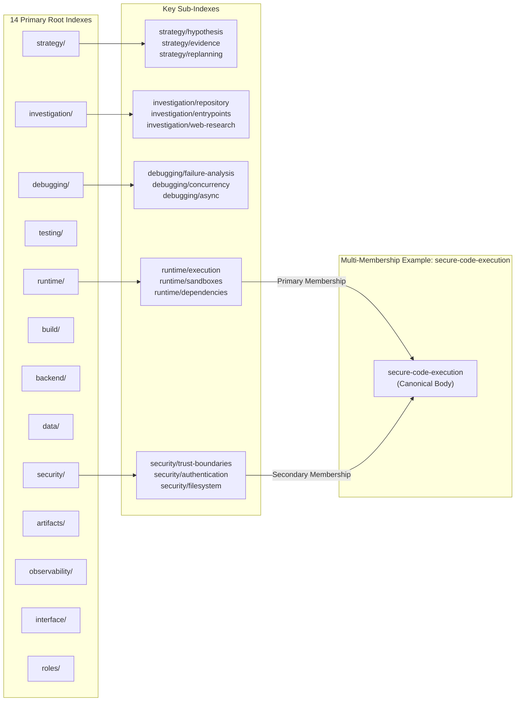

# Skill Graph v0.3 — Canonical Specification & 63-Skill Catalog

> **Status**: **FROZEN** (Incorporated from `rustbox/skill-graph-v0.3-final`)  
> **Authority**: Authoritative catalog, schema, discovery API, and fairness contracts for Agent Arena Skill Graph v2.

---

## 1. Governing Principles

1. **Curation is Navigation, Not Permission**: Suggesting skills or graph paths never restricts a fighter from invoking `use_skill(id)` directly for any public canonical skill.
2. **Advisory Relationships**: `related_skills` and `suggested_foundations` describe conceptual affinity; they never act as prerequisites or permission gates.
3. **Sparse Multi-Membership**: One canonical skill has exactly one primary index and 1–3 secondary discovery indexes. It is never copied.
4. **Separation of Expertise from Capability**: Skills teach reasoning; platform tools provide mechanical execution access.
5. **Progressive Disclosure**: Full skill markdown bodies are never dumped at startup. They are loaded strictly on demand via `use_skill(id)` and deduplicated.
6. **Strict-Mode Invariance**: In strict benchmark evaluations, discovery results and guidance are invariant to model identity, historical ratings, prior match outcomes, or user memory.
7. **Context Accounting**: Tool steps, token usage, and time spent discovering or reading skills are counted against fighter resources. No arbitrary numerical cap is placed on loaded skills.

---

## 2. Canonical Schema v2

Every canonical skill record adheres to the 16-field YAML specification:

```yaml
schema_version: 2
id: canonical-kebab-case-id
name: canonical-kebab-case-id
version: 1.0.0
summary: >
  Fighter-facing skill card summary (1-2 sentences).
indexes:
  - primary/index
  - optional/secondary/index
roles:
  - general
  - builder
  - breaker
runtimes:
  - "*"
domains:
  - strategy
  - debugging
related_skills:
  - related-skill-id
suggested_foundations:
  - foundational-skill-id
capability_affinity:
  - capability-name
context_cost_class: small | medium | large
visibility: public
benchmark_safe: true
discovery:
  strong: [keyword1, keyword2]
  normal: [keyword3, keyword4]
  weak: [keyword5]
```

---

## 3. Skill Graph v0.3 Hierarchical Index Map



---

## 4. Complete 63-Skill Canonical Catalog Reference Table

All 63 skills are organized below across their 11 core functional domains:

### 4.1 Strategy & Meta-Reasoning (Skills 1–6)

| # | Skill ID | Primary Index | Cost | Fighter Card Summary |
|---|---|---|---|---|
| 1 | `hypothesis-driven-debugging` | `strategy/hypothesis` | Medium | Develop explicit explanations for observed behavior and use targeted evidence to distinguish between them. |
| 2 | `evidence-before-editing` | `strategy/evidence` | Small | Establish what the repository and runtime are actually doing before relying on assumptions about the defect. |
| 3 | `root-cause-first` | `strategy/repair-style` | Medium | Trace visible failures through dependency and execution paths to identify the defect that produces them. |
| 4 | `failure-driven-replanning` | `strategy/replanning` | Medium | Use unsuccessful commands, tests, experiments, and attempted repairs as information for revising the current approach. |
| 5 | `minimal-change-repair` | `strategy/repair-style` | Small | Search for a compact repair that resolves the demonstrated defect while preserving unrelated behavior and interfaces. |
| 6 | `alternative-hypothesis-explorer` | `strategy/hypothesis` | Medium | Explore several credible explanations or system areas before becoming overcommitted to one theory. |

### 4.2 Investigation & Codebase Cartography (Skills 7–12)

| # | Skill ID | Primary Index | Cost | Fighter Card Summary |
|---|---|---|---|---|
| 7 | `repository-cartographer` | `investigation/repository` | Medium | Construct an execution-oriented map of an unfamiliar codebase, its important structure, entrypoints, and tests. |
| 8 | `entrypoint-tracer` | `investigation/entrypoints` | Medium | Follow control from an externally visible trigger into the implementation responsible for its behavior. |
| 9 | `dependency-tracer` | `investigation/dependencies` | Medium | Trace relationships among modules, packages, files, build targets, generated artifacts, and runtime dependencies. |
| 10 | `test-surface-mapper` | `testing/visible-tests` | Medium | Determine what available tests execute, assert, and leave untested without assuming visible tests fully describe correct behavior. |
| 11 | `configuration-auditor` | `investigation/configuration` | Medium | Trace configuration values through definitions, defaults, environment variables, files, arguments, overrides, and consumers. |
| 12 | `authority-source-finder` | `investigation/authority` | Medium | Determine which implementation, specification, test, or configuration source governs behavior when sources disagree. |

### 4.3 Debugging & Failure Analysis (Skills 13–22)

| # | Skill ID | Primary Index | Cost | Fighter Card Summary |
|---|---|---|---|---|
| 13 | `failure-classifier` | `debugging/failure-analysis` | Small | Classify unexpected behavior into symptom categories to select appropriate diagnostic techniques. |
| 14 | `minimal-reproduction-builder` | `testing/reproduction` | Medium | Isolate the simplest reproducible command, test, or script that demonstrates a reported failure. |
| 15 | `state-flow-debugger` | `debugging/state` | Medium | Track variable mutations, object states, lifecycle transitions, and data transformations through time. |
| 16 | `interface-boundary-debugger` | `debugging/interfaces` | Medium | Inspect data crossing boundaries between modules, processes, protocols, network endpoints, or serialization formats. |
| 17 | `concurrency-race-debugger` | `debugging/concurrency` | Large | Diagnose race conditions, deadlocks, lock contention, thread starvation, and timing bugs in shared-memory environments. |
| 18 | `async-control-flow-debugger` | `debugging/async` | Medium | Untangle asynchronous execution paths, unhandled promise rejections, dangling tasks, and callback order issues. |
| 19 | `runtime-inspector` | `runtime/inspection` | Small | Query dynamic runtime state, active interpreters, memory footprints, and environment flags during execution. |
| 20 | `git-history-forensics` | `investigation/history` | Small | Analyze git diffs, commit histories, blame annotations, and recent refactors to locate regression sources. |
| 21 | `python-kata-fixer` | `strategy/specialist` | Small | Repair compact functional and algorithmic coding challenges adhering to strict mathematical assertions. |
| 22 | `subprocess-command-debugger` | `debugging/subprocess` | Medium | Troubleshoot external process launches, shell escapes, environment inheritance, and pipe deadlocks. |

### 4.4 Testing & Verification (Skills 23–28)

| # | Skill ID | Primary Index | Cost | Fighter Card Summary |
|---|---|---|---|---|
| 23 | `regression-test-designer` | `testing/regression` | Medium | Design automated assertions that guarantee repaired bugs cannot silently re-emerge in future iterations. |
| 24 | `property-based-tester` | `testing/property-based` | Large | Generate generative randomized test inputs to discover edge-case boundary condition failures. |
| 25 | `mock-boundary-designer` | `testing/mocks` | Medium | Isolate external dependencies using lightweight test doubles without distorting real system semantics. |
| 26 | `flaky-test-stabilizer` | `testing/flakiness` | Medium | Identify nondeterministic timing, unseeded random values, and global state pollution destabilizing test suites. |
| 27 | `fuzz-harness-builder` | `testing/fuzzing` | Large | Construct structured fuzzing harnesses to probe parsers and protocols with mutated payloads. |
| 28 | `acceptance-verifier` | `testing/acceptance` | Small | Verify that end-to-end deliverables satisfy public acceptance criteria and mission contracts. |

### 4.5 Runtime, Packages & Build (Skills 29–35)

| # | Skill ID | Primary Index | Cost | Fighter Card Summary |
|---|---|---|---|---|
| 29 | `package-dependency-resolver` | `runtime/packages` | Medium | Reconcile broken lockfiles, corrupted package manifests, version incompatibilities, and missing imports. |
| 30 | `build-system-architect` | `build/systems` | Medium | Untangle complex Makefiles, CMake targets, npm build scripts, and multi-stage build pipelines. |
| 31 | `compiler-error-diagnostician` | `build/compiler-errors` | Small | Interpret opaque C/C++, Rust, or TypeScript compiler diagnostics to pinpoint type and syntax errors. |
| 32 | `container-environment-auditor`| `runtime/sandboxes` | Medium | Verify container virtualization limits, filesystem mounts, cgroups, and user permission namespaces. |
| 33 | `filesystem-path-auditor` | `security/filesystem` | Small | Audit relative vs absolute path resolution, directory traversal risks, and symlink escape vulnerabilities. |
| 34 | `python-environment-manager` | `runtime/python` | Small | Reconcile virtualenv paths, wheel binary compatibility, PYTHONPATH conflicts, and entrypoint scripts. |
| 35 | `node-runtime-specialist` | `runtime/node` | Small | Diagnose Node.js CommonJS vs ESM interop issues, engine version gates, and npm/pnpm resolution rules. |

### 4.6 Backend & Distributed Systems (Skills 36–41)

| # | Skill ID | Primary Index | Cost | Fighter Card Summary |
|---|---|---|---|---|
| 36 | `api-contract-designer` | `backend/api` | Medium | Define clean REST, RPC, or GraphQL interfaces with strict request/response schema validations. |
| 37 | `state-machine-architect` | `backend/state-machines`| Medium | Model complex business logic into explicit, deterministic state machines with verifiable transitions. |
| 38 | `rate-limiter-architect` | `backend/rate-limiting` | Medium | Implement token bucket, sliding window, and distributed rate limiting algorithms for API endpoints. |
| 39 | `websocket-stream-debugger` | `backend/streaming` | Medium | Troubleshoot SSE event streams, WebSocket frame multiplexing, connection drops, and message deduplication. |
| 40 | `caching-strategy-designer` | `backend/caching` | Medium | Implement write-through, LRU, and tag-invalidated cache architectures preventing thundering herds. |
| 41 | `distributed-transaction-manager`| `backend/transactions` | Large | Coordinate multi-phase commits, saga orchestrations, and optimistic concurrency controls. |

### 4.7 Data & Persistence (Skills 42–45)

| # | Skill ID | Primary Index | Cost | Fighter Card Summary |
|---|---|---|---|---|
| 42 | `schema-migration-repairer` | `data/migrations` | Medium | Reconcile conflicting database migration scripts (Alembic, Prisma, Flyway) without data loss. |
| 43 | `sql-query-optimizer` | `data/sql-performance` | Medium | Analyze query execution plans, missing indices, table scans, and N+1 query bottlenecks. |
| 44 | `orm-impedance-debugger` | `data/orm` | Medium | Troubleshoot SQLAlchemy, Prisma, or Hibernate session states, flush lifecycles, and lazy loading errors. |
| 45 | `vector-embedding-searcher` | `data/vector-search` | Medium | Tune cosine similarity thresholds, pgvector index parameters, and semantic chunking strategies. |

### 4.8 Security & Adversarial Defense (Skills 46–52)

| # | Skill ID | Primary Index | Cost | Fighter Card Summary |
|---|---|---|---|---|
| 46 | `auth-flow-debugger` | `security/authentication`| Large | Trace credentials from transport through password hashing, JWT/session issuance, and authorization checks. |
| 47 | `authorization-boundary-auditor`| `security/authorization`| Medium | Prevent Broken Object Level Authorization (BOLA), IDOR, and role escalation in secure endpoints. |
| 48 | `injection-vulnerability-auditor`| `security/injection` | Medium | Detect and eliminate SQL injection, command injection, template injection, and eval vulnerabilities. |
| 49 | `ssrf-defense-architect` | `security/ssrf` | Medium | Implement hardened egress filtering, private IP blocking, and cloud metadata defense gates. |
| 50 | `crypto-protocol-auditor` | `security/cryptography` | Large | Audit AES, RSA, HMAC, and PBKDF2 implementations for weak entropy, IV reuse, and timing leaks. |
| 51 | `session-replay-defender` | `security/sessions` | Medium | Protect APIs against replay attacks using cryptographic nonces, timestamps, and token binding. |
| 52 | `secure-code-execution` | `runtime/execution` | Large | Construct hardened sandboxes enforcing chroot, seccomp, landlock, and subprocess timeouts. |

### 4.9 Builder & Breaker Duels (Skills 53–56)

| # | Skill ID | Primary Index | Cost | Fighter Card Summary |
|---|---|---|---|---|
| 53 | `adversarial-defense-builder` | `roles/builder` | Large | Harden applications against automated exploit generation while preserving legitimate functionality. |
| 54 | `invariant-breaker` | `roles/breaker` | Large | Formulate exploit payloads that violate underlying system assumptions without crashing the runner. |
| 55 | `defense-evasion-auditor` | `security/adversarial` | Medium | Inspect how inputs bypass naive regex blacklists, WAF filters, and string sanitizers. |
| 56 | `honeypot-telemetry-collector`| `roles/builder` | Medium | Embed canary tokens and deceptive artifacts to trace and detect unauthorized adversary probing. |

### 4.10 Observability & Telemetry (Skills 57–59)

| # | Skill ID | Primary Index | Cost | Fighter Card Summary |
|---|---|---|---|---|
| 57 | `structured-logger-architect` | `observability/logging` | Small | Implement standardized JSON logging pipelines with contextual trace IDs and secret masking. |
| 58 | `metrics-instrumenter` | `observability/metrics` | Small | Instrument application code with latency histograms, error counters, and saturation gauges. |
| 59 | `distributed-tracer` | `observability/tracing` | Medium | Propagate OpenTelemetry W3C trace context headers across process and network boundaries. |

### 4.11 Frontend, Browser & Integration (Skills 60–63)

| # | Skill ID | Primary Index | Cost | Fighter Card Summary |
|---|---|---|---|---|
| 60 | `dom-interaction-automator` | `interface/browser` | Medium | Control headless browser engines via Chrome DevTools / Playwright to test end-to-end user flows. |
| 61 | `state-hydration-debugger` | `interface/react` | Medium | Diagnose React/Next.js client-server state mismatches, hydration errors, and useEffect loops. |
| 62 | `technical-web-researcher` | `investigation/web` | Medium | Formulate precise technical queries and extract verifiable documentation from the public web. |
| 63 | `api-mock-server-builder` | `interface/integration`| Small | Spin up ephemeral mock servers simulating third-party webhook callbacks and API responses. |

---

## 5. Fighter Discovery API Contract

Fighters interact with the Skill Graph through five progressive operations:

```text
1. skills()
   -> Returns root graph overview, index categories, and public-context entrance suggestions.

2. skills(index="security")
   -> Returns sub-indexes (security/authentication, security/ssrf, etc.) and compact child entries.

3. skills(index="security/authentication")
   -> Returns compact skill cards belonging to that specific sub-index.

4. skills(search="session replay token")
   -> Executes deterministic lexical search across canonical metadata and graph memberships.

5. skills(skill="auth-flow-debugger")
   -> Returns detailed card metadata (indexes, cost class, related skills, discovery tags).

6. use_skill("auth-flow-debugger")
   -> Loads the canonical markdown body into context. Deduplicated on subsequent calls.
```

### Direct Invocation Invariant
`use_skill(id)` **must succeed** for any legitimate public skill ID even if the skill was never recommended, searched, offered, or inspected.

---

## 6. Deterministic Lexical Search Weights

The discovery search engine (`backend/agent_arena/skills/discovery.py`) orders search results deterministically:

| Match Scope | Weight | Semantic Rationale |
|---|---|---|
| Exact Match on Skill ID | `100.0` | Direct request for specific skill name |
| Strong Discovery Keyword Match | `40.0` | High-precision domain problem-class evidence |
| Token Substring in Skill ID | `25.0` | Partial skill name match |
| Normal Discovery Keyword Match | `20.0` | Standard diagnostic concept match |
| Summary Text Match | `8.0` | Card summary description match |
| Weak Discovery Keyword Match | `5.0` | Generic programming language or framework keyword |
| Domain Term Match | `3.0` | High-level functional domain match |
| Index Term Match | `2.0` | Hierarchy category match |
| Role Match | `1.0` | Role tag match (`builder`, `breaker`, `general`) |
| Runtime Match | `0.5` | Intentionally low to prevent language bias from overriding problem-class relevance |

---

## 7. Navigation Telemetry & Strategy Signatures

Every graph interaction is durably recorded:
- `indexes_viewed`, `subindexes_viewed`, `searches_performed`, `skill_cards_viewed`, `skills_loaded`, `skills_used`, `skills_attributed`.

From this telemetry, the backend derives a deterministic behavioral hash:
$$\text{strategy\_signature\_v1} = \text{SHA-256}(\text{ordered\_navigation} + \text{skill\_loads} + \text{initial\_tool\_sequence} + \text{replanning\_points})$$

This signature allows researchers to compare whether models with different training data converge on identical or divergent problem-solving strategies without relying on subjective LLM evaluations.
